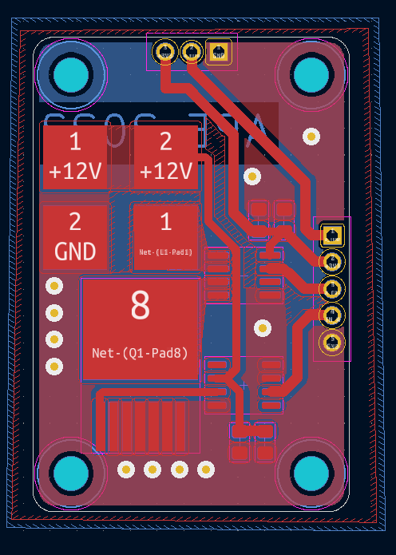
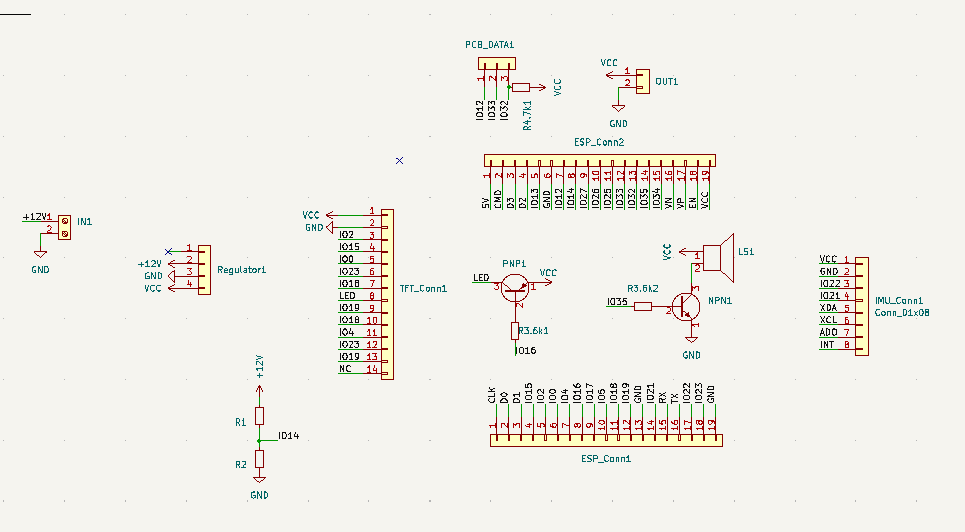
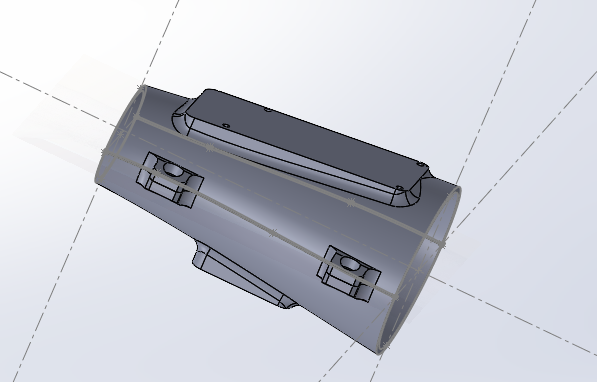
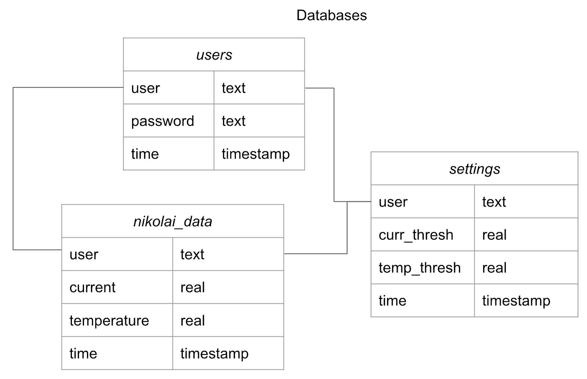

# Nikolai: electromagnet gauntlet

Nikolai is a 3D-printed gauntlet with a hand-wound **electromagnet in the palm**, so the wearer can pick up and hold ferromagnetic objects. It has three main parts:

- an ESP32 on the wrist that controls coil power with PWM and shows a touchscreen UI;
- a MOSFET coil driver that measures coil current and temperature;
- a small web server that stores per-user safety limits and logs sensor data.

It was a five-person team project for MIT **6.08** (Interconnected Embedded Systems) in spring 2022.

[](http://www.youtube.com/watch?v=RmYVuiprXAE "Nikolai demo")

## Team

James Adams, Daven Howard, Sebastian Portalatin, **Ahmad Taka** and Colin Tang.

## Status

| Area | Status |
|---|---|
| Electrical | ✅ Coil driver v1 and v2 and the wrist PCB, all routed with Gerbers; schematic PDFs in `electrical/` |
| Firmware | ✅ `Firmware_V2` (PlatformIO, GUIslice touchscreen UI) is the final version; `Firmware_V1` is archived |
| Server | ✅ Worked on the class server; archived in `archive/Server` |
| Mechanical | ✅ Hand, forearm and coil mounts (SolidWorks), with STL and Ultimaker print files |

## Repository layout

```
nikolai_project/
├── electrical/
│   ├── coil_driver_v1/      KiCad 6 "maghand" (2-channel coil driver)
│   ├── coil_driver_v2/      KiCad 6 "maghand" (1-channel, smaller)
│   ├── wrist_pcb_v1/        KiCad 6 wrist board (ESP32 + display)
│   ├── Coil_Driver.pdf      coil driver schematic
│   └── Nikolai_Schematic.pdf  system schematic
├── firmware/Firmware_V2/    PlatformIO project (ESP32, final)
├── mechanical/
│   ├── cad/Nikolai.SLDASM   full assembly; Parts/{Hand,Forearm,Coil}
│   ├── exports/stl/         printable parts
│   └── cam/UMS3_*.3mf       Ultimaker S3 print projects (coil, forearm, hand)
├── archive/
│   ├── Firmware_V1/         first Arduino firmware + bring-up test sketches
│   ├── Server/              server.py, SQLite DB, web pages
│   └── Docs/Final Report/   full class write-up (Markdeep)
└── docs/images/             figures used below
```

## How it works


- **Power path:** a 3S LiPo powers the coil driver and the wrist board. The wrist board steps the battery down to 3.3 V with a switching regulator. The ripple was checked on a scope and was fine for the ESP32.
- **Control:** the ESP32 outputs **10 kHz, 8-bit PWM** to the coil driver's gate driver. The power level is set with a slider on the touchscreen.
- **Sensing:** coil current comes from a TI **TMCS1107** Hall-effect sensor. Its output maps about −2.8 to 27.7 A onto 0–3.3 V, and the firmware subtracts a measured bias of about −1.3 A. Coil temperature comes from a **DS18B20** 1-Wire sensor mounted in the coil housing.
- **Safety FSM:** if the current or temperature goes above the user's threshold, the firmware sets a fault flag, turns the coil off and locks the power slider at 0. The flag clears only after a sustained period of low current and low temperature.
- **Cloud sync:** the ESP32 regularly POSTs current and temperature readings for the selected user, and can pull that user's thresholds from the server (the "Sync" button).

## Hardware

### Coil

About **700 turns of 24 AWG** magnet wire, wound with a drill onto a custom 3D-printed bobbin with a **permalloy core**. The bobbin also mounts the coil to the palm and holds the temperature sensor and flyback diode. In testing the coil handled about **145 W for roughly 3 s** before heating became a concern.

[](http://www.youtube.com/watch?v=-3nESWdEpc8 "Coil test")

### Coil driver (`electrical/coil_driver_v1`, `coil_driver_v2`)

| | v1 | v2 |
|---|---|---|
| Switch | 2 × **C3M0065090J** SiC MOSFET | 1 × C3M0065090J |
| Gate driver | **MCP14A0304** | MCP14A0304 |
| Current sense | 2 × **TMCS1107A1B** | 1 × TMCS1107A1B |
| Temperature | 2 × **DS18B20** | 1 × DS18B20 |
| Connectors | 2-pin battery input, 8-pin to wrist and coil | 2-pin battery input, 5-pin |
| Board | 2 layers, 48.3 × 55.9 mm | 2 layers, 30 × 45 mm |

The board has three ports: coil output and temperature-sensor input; power, PWM in and sensor data out to the ESP32; and the LiPo input.




### Wrist PCB (`electrical/wrist_pcb_v1`)

2 layers, 93.5 × 45.5 mm, all through-hole. The board has:

- two 1 × 19 sockets for a 38-pin **ESP32 dev board**;
- a 1 × 14 socket for the **ILI9341** touchscreen module;
- a 1 × 4 socket for the switching-regulator module;
- an 8-pin connector to the coil driver;
- a 2N3904/2N3906 transistor pair with a speaker;
- a screw terminal for the 12 V battery input.




### 3D-printed parts

A team member's hand, wrist and forearm were measured by hand, and mounts for each PCB and the coil were modeled around them in **SolidWorks 2021**. The parts were printed in **Tough PLA** on an Ultimaker S3.




## Firmware (`firmware/Firmware_V2`)

| Setting | Value |
|---|---|
| Board | `esp32dev` (Espressif32, Arduino framework), monitor at 115200 baud |
| Libraries | GUIslice ^0.17, TFT_eSPI ^2.4.61, OneWire ^2.3.6, DallasTemperature ^3.9.1, ArduinoJson ^6.19.4 |
| UI | GUIslice pages (Main, Settings with numeric keypad, User select, Power slider with live current and temperature meters, Sync and Wi-Fi buttons). The GUIslice Builder project is `guislice/guislice.prj`. |

| Pin | Function |
|---|---|
| GPIO 12 | Coil PWM out |
| GPIO 32 | DS18B20 data |
| GPIO 33 | Current sensor (ADC) |
| GPIO 14 | Battery voltage (ADC) |
| GPIO 16 | Display backlight |

```bash
cd firmware/Firmware_V2
pio run -t upload && pio device monitor
```

> **Before building:** TFT_eSPI reads its display and touch pins from its own `User_Setup.h`, and that file isn't in this repo. Configure it for an ILI9341 with touch and match your wiring. The Wi-Fi network and the server URL are hard-coded in `include/iot_server.h`, so point them at your own network and server.

## Server (`archive/Server`)

`server.py` is a single `request_handler(request)` script written for the 6.08 class server (`608dev-2.net`, sandbox `team73`). It stores data in SQLite (`dbs/nikolai.db`) using three tables:

| Table | Columns |
|---|---|
| `users` | time, user, password |
| `nikolai_data` | time, current, temperature, user |
| `settings` | time, user, power_lvl, curr_thresh, temp_thresh |

| Request | Purpose |
|---|---|
| `GET ?Uname=&Pass=` | Validate a login (used by `login.html`) |
| `GET ?visualize=true&Uname=[&time_start=&time_end=]` | Current and temperature history, plotted with Bokeh on `home.html` |
| `GET ?settings=true&Uname=` | Fetch a user's thresholds (used by the web page and by the ESP32 "Sync") |
| `POST Uname, Pass, current, temperature` | ESP32 sensor upload |
| `POST Uname, Pass, curr_thresh, temp_thresh` | Update thresholds from the web page or the ESP32 |



> This was a class demo. Passwords are stored and compared in plain text, so don't deploy it as-is.

## Reproducing

1. Wind the coil on the printed bobbin (`mechanical/exports/stl/Coil`) around a permalloy core, and fit the DS18B20 and a flyback diode.
2. Order or mill the coil driver and wrist boards from the Gerbers in each board folder (`g/` or `GBR/`). They open in KiCad 6 or newer.
3. Print the hand, forearm and coil mounts.
4. Host `server.py` on any Python server that calls `request_handler` with `method`, `args`, `values` and `form`. That is the 6.08 server convention; a small Flask wrapper also works.
5. Configure TFT_eSPI, set the server URL and Wi-Fi, and flash `Firmware_V2`.

The complete original write-up, with the API details, UI screenshots and the design discussion, is in [`archive/Docs/Final Report/README.md`](archive/Docs/Final%20Report/README.md).
